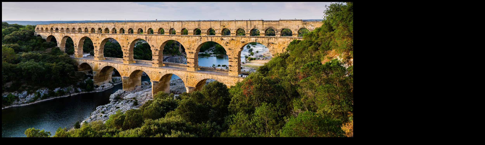

# image-stitching
 The script in this repo has a basic image stitching Pipeline. The pipeline consists of Following steps: \
 1. Extracting features from images. Right now I am using SIFT detector to extract features from images.
 2. Match the extracted features from the images which are to be stitched together. 
 3. Calculate Homography using the matched features. I have written custom code to calculate homography with RANSAC implementation.
 4. Once we have the homography we can use the homography to foward warp/backward warp the source image to the target image plane.

 ## Results:
 ### Input
 

### Stitched Image

## To Do:
1. Use other image feature Extraction algorithms. For Ex: ORB
2. Implement and add Blending algorithm.
